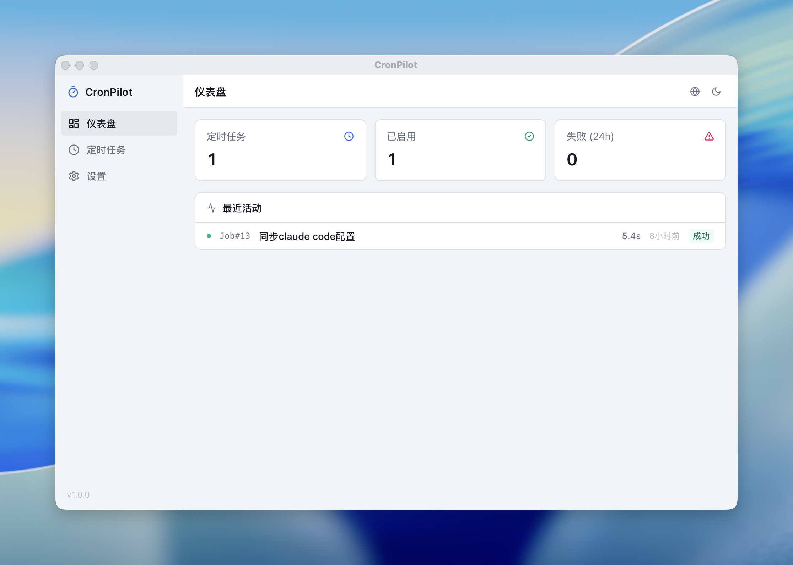
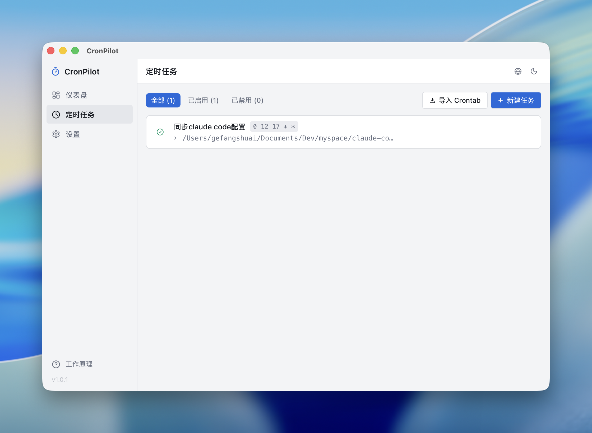

<p align="right">
  <a href="README.md">English</a>
</p>

<h1 align="center">CronPilot</h1>

<p align="center">
  <strong>本地 crontab 可视化管理桌面工具</strong><br>
  告别手动编辑 crontab，用图形界面轻松管理定时任务
</p>

<p align="center">
  <a href="https://github.com/lifedever/CronPilot/releases/latest">
    
  </a>
  <a href="https://github.com/lifedever/CronPilot/releases">
    
  </a>
  
  <a href="https://github.com/lifedever/CronPilot/blob/main/LICENSE">
    
  </a>
</p>

## 截图

| 仪表盘 | 任务管理 | 冲突检测 |
|:---:|:---:|:---:|
|  |  |  |

## 功能

- **任务管理** - 创建、编辑、删除、启用/禁用定时任务
- **可视化 Cron 构建器** - 三种模式（简单/高级/原始），预设快捷选项，实时校验，下次执行时间预览
- **执行日志** - 自动捕获 cron 定时执行的 stdout/stderr、退出码、执行耗时（毫秒精度），支持手动触发实时日志流
- **Crontab 冲突检测** - 启动时自动检测系统 crontab 与应用数据的差异，提供四种解决策略：以本地为准、以应用为准、合并、暂不处理（类似 Git 冲突解决）
- **系统 crontab 同步** - 修改自动同步到系统 crontab，支持一键导入已有任务
- **仪表盘** - 任务统计、最近执行活动（分页加载）、日志清理（按时间范围）、自动/手动刷新
- **中英双语** - 自动跟随系统语言，支持手动切换
- **暗色模式** - 浅色/深色/跟随系统三种主题
- **命令校验** - 保存前检测脚本是否可执行，识别危险命令并警告
- **数据备份** - 支持导出/导入任务配置，修改 crontab 前自动快照

## 开发

### 环境要求

- [Rust](https://rustup.rs/)
- [Node.js](https://nodejs.org/) >= 18
- [pnpm](https://pnpm.io/)
- macOS: Xcode Command Line Tools
- Linux: `libwebkit2gtk-4.1-dev`, `libappindicator3-dev`, `librsvg2-dev`

### 启动开发

```bash
# 安装依赖
pnpm install

# 启动开发环境 (前端热更新 + Rust 后端)
pnpm tauri dev
```

### 构建

```bash
# 生产构建
pnpm tauri build
```

构建产物在 `src-tauri/target/release/bundle/` 目录下：

- macOS: `.dmg` / `.app`
- Linux: `.deb` / `.AppImage`

### 项目结构

```text
src/          # React 前端
src-tauri/    # Rust 后端 (Tauri)
```

## 捐赠支持

如果 CronPilot 对你有帮助，欢迎[捐赠支持](https://lifedever.github.io/sponsor/)开发者持续维护。
